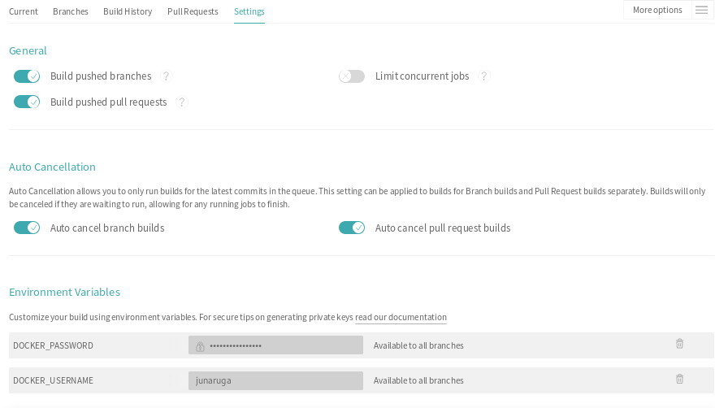

# Contributing to multiarch/qemu-user-static

Your contributions such as reporting a bug and sending pull-request are very wellcome! Thank you.

## Did you find a bug?

* Ensure the bug was not already reported by searching on GitHub under Issues.
* multiarch/qemu-user-static is a collection of containers to enable people to emulate multi-architecture containers by using qemu-user-static (= a collection of QEMU's user mode static binaries `qemu-$arch-static`) [1] and binfmt_misc [2]. This repository is not QEMU project's one. If you find a bug about them, you can visit the website [1][2] to report an issue on the projects.

## How to send pull-request

1. Fork the repository: https://github.com/multiarch/qemu-user-static . Ex. https://github.com/junaruga/qemu-user-static
2. This repository is using Travis CI. You can test your modified code on your forked repository before sending a pull-requeste. Go to https://travis-ci.org/your_account_name/qemu-user-static , then enable Travis. Ex. https://travis-ci.org/junaruga/qemu-user-static
3. If you want to test pushing created container images,
    * You need to have your own container repository such as DockerHub or Quay.io. Ex. https://quay.io/repository/junaruga/qemu-user-static
    * You need to set environment variables `DOCKER_USERNAME` and `DOCKER_PASSWORD` on your repository's Travis CI Settings page. Please remember it is better to set `DOCKER_PASSWORD` without displaying the value for your security.
  

4. You also need to have your https://quay.io/repository/junaruga/qemu-user-static
5. You need to edit `.travis.yml` with your container repository. This step can be improved in the future.
6. Below is an example of how to test with your container repository.

```
$ git diff
diff --git a/.travis.yml b/.travis.yml
index 79ca070..edee35e 100644
--- a/.travis.yml
+++ b/.travis.yml
@@ -15,13 +15,13 @@ env:
         - VERSION=4.0.0-5
         # See qemu-user-static's RPM spec file on Fedora to check the new version.
         # https://src.fedoraproject.org/rpms/qemu/blob/master/f/qemu.spec
-        - DOCKER_SERVER=docker.io
-        # - DOCKER_SERVER=quay.io
+        # - DOCKER_SERVER=docker.io
+        - DOCKER_SERVER=quay.io
         # Git repository
         - REPO=multiarch/qemu-user-static
         # Container repository
-        - DOCKER_REPO=$DOCKER_SERVER/multiarch/qemu-user-static
-        # - DOCKER_REPO=$DOCKER_SERVER/your_username/qemu-user-static
+        # - DOCKER_REPO=$DOCKER_SERVER/multiarch/qemu-user-static
+        - DOCKER_REPO=$DOCKER_SERVER/junaruga/qemu-user-static
 
         - PACKAGE_URI="https://kojipkgs.fedoraproject.org/packages/qemu/4.0.0/5.fc31/x86_64/qemu-user-static-4.0.0-5.fc31.x86_64.rpm"
         - PACKAGE_FILENAME=$(basename "$PACKAGE_URI")
@@ -39,7 +39,7 @@ script:
     - ./test.sh -d "$DOCKER_REPO"
 after_success:
     - |
-      if [[ $TRAVIS_BRANCH == 'master' && $TRAVIS_PULL_REQUEST == 'false' ]]; then
+      # if [[ $TRAVIS_BRANCH == 'master' && $TRAVIS_PULL_REQUEST == 'false' ]]; then
           docker login -u="$DOCKER_USERNAME" -p="$DOCKER_PASSWORD" "$DOCKER_SERVER" && \
               docker push "$DOCKER_REPO"
-      fi
+      # fi
```

7. Check Travis CI's log, and ensure the container images are created.
8. You are ready to send the pull-request!

## References

* [1] QEMU: https://www.qemu.org/
* [2] binfmt-misc: https://www.kernel.org/doc/html/latest/admin-guide/binfmt-misc.html

